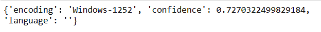
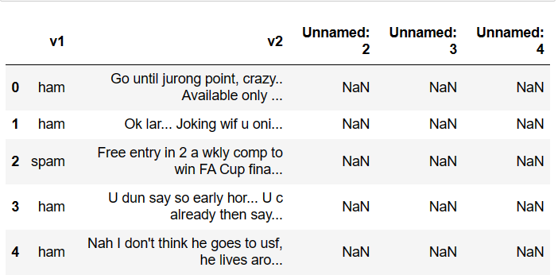
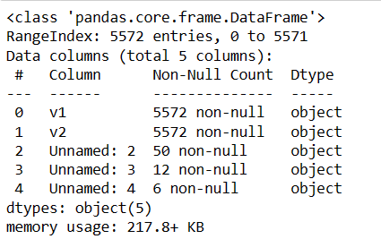
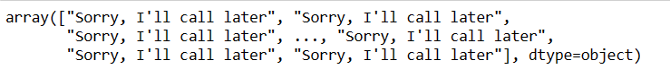
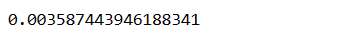

# Ex-No:9 Implementation-of-SVM-For-Spam-Mail-Detection

## AIM:
To write a program to implement the SVM For Spam Mail Detection.

## Equipments Required:
1. Hardware – PCs
2. Anaconda – Python 3.7 Installation / Jupyter notebook

## Algorithm
1. Import the necessary packages using import statement. 
2. Read the given csv file and print the number of contents to be displayed. 
3. Split the dataset using train_test_split. 
4. Calculate Y_Pred and accuracy. 
5. Display the result.

## Program:
```python
# Program to implement the SVM For Spam Mail Detection..
# Developed by: Krithick Vivekananda
# RegisterNumber: 212223240075 

import chardet
file="spam.csv"
with open(file,'rb') as rawdata:
    result=chardet.detect(rawdata.read(100000))
result

import pandas as pd
data=pd.read_csv("spam.csv",encoding='Windows-1252')

data.head()

data.info()

data.isnull().sum()

x=data["v1"].values
y=data["v2"].values

from sklearn.model_selection import train_test_split
x_train,x_test,y_train,y_test=train_test_split(x,y,test_size=0.2,random_state=0)

from sklearn.feature_extraction.text import CountVectorizer
cv=CountVectorizer()

x_train=cv.fit_transform(x_train)
x_test=cv.transform(x_test)

from sklearn.svm import SVC
svc=SVC()
svc.fit(x_train,y_train)
y_pred=svc.predict(x_test)
y_pred

from sklearn import metrics
accuracy=metrics.accuracy_score(y_test,y_pred)
accuracy
```

## Output:
### Result:

### data.head():

### data.info():

### y-prediction values:

### Accuracy:


## Result:
Thus the program to implement the SVM For Spam Mail Detection is written and verified using python programming.
